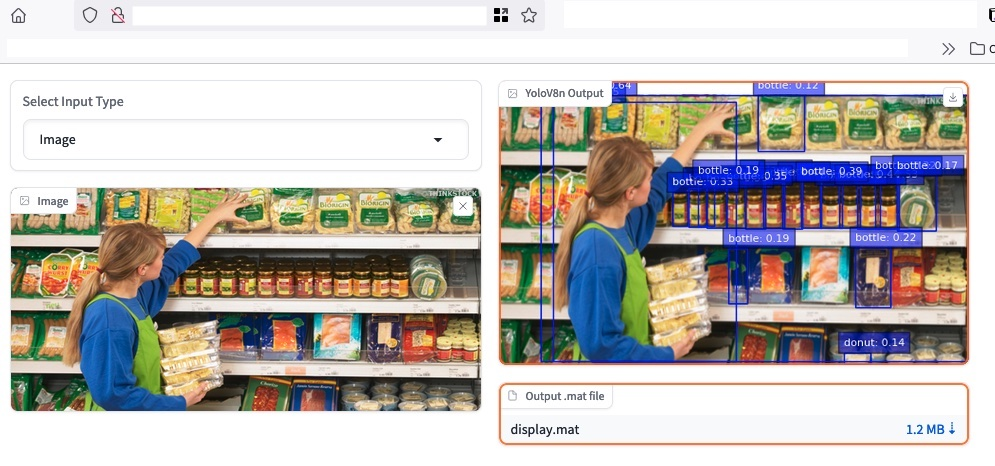

## Deploying the YOLO Pipeline pulling images from hub.docker.com (download and run)

The -Single command- below will fireup the download of all required containers, but if you want to pull them prior to running the pipeline type :
```shell
$ docker pull sipgisr/yolo_grpc (8Gb image)
$ docker pull sipgisr/gradio_grpc
$ docker pull sipgisr/grpc-orchestrator
```
### Single command 

1- Deploying for a single session or in a personal computer. CD to the location of the docker-compose.yml file type the command in a shell
```shell
$ docker compose up
```

2- Deploying the pipeline in a server for multiple users or to have it running in the background launch it as a daemon
```shell
$ docker compose up -d
```

Open a browser window and type http://localhost:7860 or http://your.server.ip.address:7860

3-To stop type (you must interrupt with  CTL-C if running as in 1- and) 

```shell
$ docker compose down
```
### Results

The interface will display the detected objects in the image and a .mat file with the data. You can download the file at any moment. The format is described in the [Yolo-grpc](https://github.com/jpcosteira/CIV5164Z/tree/main/Project/Yolo_grpc) folder.




